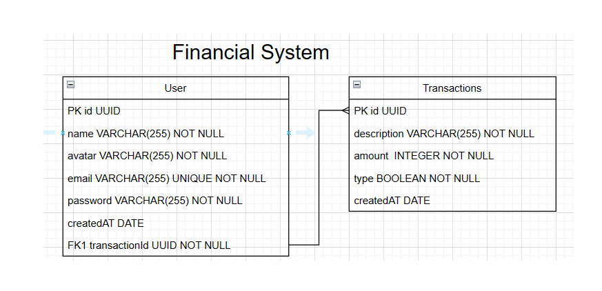

#  Financial-System

## 1. Visão Geral

Visão geral do projeto, um pouco das tecnologias usadas.

- [NodeJS](https://nodejs.org/en/)
- [Express](https://expressjs.com/pt-br/)
- [TypeScript](https://www.typescriptlang.org/)
- [PostgreSQL](https://www.postgresql.org/)
- [TypeORM](https://typeorm.io/)
- [Yup](https://www.npmjs.com/package/yup)

---

## 2. Diagrama ER

[ Voltar para o topo ](#tabela-de-conteúdos)

Diagrama ER da API definindo bem as relações entre as tabelas do banco de dados.



---

## 3. Início Rápido

[ Voltar para o topo ](#tabela-de-conteúdos)

### 3.1. Instalando Dependências

Clone o projeto em sua máquina e instale as dependências com o comando:

```
yarn
```

### 3.2. Variáveis de Ambiente

Em seguida, crie um arquivo **.env**, copiando o formato do arquivo **.env.example**:
Configure suas variáveis de ambiente com suas credenciais do Postgres e uma nova database da sua escolha.

### 3.3. Migrations

Execute as migrations com o comando:

```
yarn typeorm migration:run -d src/data-source.ts
```

---

## 4. Autenticação

[ Voltar para o topo ](#tabela-de-conteúdos)

Para autenticar o usuário basta fazer login na rota:  - [POST - /login](#11-login-do-usuário)

---

## 5. Endpoints

[ Voltar para o topo ](#tabela-de-conteúdos)

### Índice

- [Users](#1-users)
  - [POST - /users](#11-criação-do-usuário)
  
- [Login](#2-login)
  - [POST - /login](#21-login-do-usuário)
  
- [Transactions](#3-transactions)
  - [POST - /transactions](#31-criação-da-transação)
  - [GET - /transactions](#32-listando-todas-transações)
  - [DELETE - /transactions/:id](#33-deletar-transação)

## Endpoints Resumo

### 1. /users

O objeto User é definido como:

| Campo       | Tipo   | Descrição                          |
| ----------- | ------ | ---------------------------------- |
| id          | string | Identificador único do usuário.    |
| name        | string | Nome do usuário.                   |
| email       | number | Email do usuário.                  |
| avatar      | number | Foto do usuário.                   |
| password    | string | Senha do usuário.                  |
| createdAt   | Date   | Data que o usuário foi cadastrado. |
| updatedAt   | Date   | Data que o usuário foi atualizado. |

### Endpoints

| Método | Rota          | Descrição                                      | Autorizaçao | Adm |
| ------ | ------------- | ---------------------------------------------- | ----------- | --- |
| POST   | /users        | Criação de um usuário.                        |             |     |

### 1.1. **Criação do Usuário**

### `/users`

### Exemplo de Request:

```
POST /users
Content-type: application/json
```

### Corpo da Requisição:

```json
{
	"name":"daniel",
	"email":"daniel@mail.com",
	"avatar":"https://media-exp1.licdn.com/dms/image/",
	"password":"123845678"
}
```

### Schema de Validação com Yup:

```javascript
name: yup.string().required(),
email: yup.string().email().required(),
avatar: yup.string().url().required(),
password: yup.string().min(9).required()
```

OBS.: Chaves não presentes no schema serão removidas e valores vazios ou nulos não serão aceitos.

### Exemplo de Response:

```
201 Created
```

```json
"users": {
		"id": "c49f9657-1151-49a4-bed7-c3344422e960",
		"name": "daniel",
		"email": "daniel@mail.com",
		"avatar": "https://media-exp1.licdn.com/dms/image",
		"createdAt": "2022-09-24T19:43:29.054Z",
		"updatedAt": "2022-09-24T19:43:29.054Z"
	}
```

### Possíveis Erros:

| Código do Erro  | Descrição                                  |
| --------------- | ------------------------------------------ |
| 400 bad request |  Email already exists                      |

```

### 2. /login - Somente usuário faz login

| Método | Rota   | Descrição                           | Autorizaçao | Adm |
| ------ | ------ | ----------------------------------- | ----------- | --- |
| POST   | /login | Faz login do usuário e gera token.  |     X       |     |

### Possíveis Erros:

| Código do Erro  | Descrição                   |
| --------------- | --------------------------- |
| 403 Forbidden	  | Invalid email            	|
| 403 Forbidden   | Invalid password		|

### 3. /transactions

O objeto Transactions é definido como:

| Campo       | Tipo   | Descrição                          |
| ----------- | ------ | ---------------------------------- |
| id          | string | Identificador único do usuário.    |
| post        | string | Nome do usuário.                   |
| createdAt   | Date   | Data que o usuário foi cadastrado. |
| updatedAt   | Date   | Data que o usuário foi atualizado. |

### Endpoints

| Método   | Rota                    | Descrição                                      | Autorizaçao | Adm |
| -------- | ---------------         | ---------------------------------------------- | ----------- | --- |
| GET      | /transactions           | Lista todas as transações.                     |             |     |
| POST     | /transactions           | Criação de uma transação.                      |      X      |     |
| DELETE   | /transactions:id        | Deleção de um  transações.                     |             |     |

### 3.1. **Criação do Post**

### `/transactions`

### Exemplo de Request:

```
POST /transactions
Content-type: application/json
```

### Corpo da Requisição:

```json
{
    "description":"Cinema",
    "amount": "200",
    "type:"Saída"
}
```

### Exemplo de Response:

```
201 Created
```

```json
{
"transactions": {
	"id": "9fcfa2b8-10ba-4c6a-b212-4ec8a5f7083a",
	"description": "cinema",
    "amount": "200",
  "type:"Saída"
	"user": {
	"id": "c49f9657-1151-49a4-bed7-c3344422e960",
	"name": "josias",
	"email": "josias@mail.com",
	"avatar": "https://media-exp1.licdn.com/dms/image",
	"password": "$2a$10$Q4G.R8L1WEt648SazHwVLexM1eNs5k/.tP2xFCbZjJ0V4scdsNgUy",
	"createdAt": "2022-09-24T19:43:29.054Z",
	"updatedAt": "2022-09-24T19:43:29.054Z"
	}

}

```

### Possíveis Erros:

| Código do Erro  | Descrição                                  |
| --------------- | ------------------------------------------ |
| 400 bad request |  Invalid user id                   	       |


### 3.2. **Listando Transações**

### `/transactions`

### Exemplo de Request:

```
GET /transactions
Content-type: application/json
```

### Corpo da Requisição:

```json
Vazio
```

### Exemplo de Response:

```
200 Ok
```

```json

{
"transactions": [
	transactions": {
    "id": "9fcfa2b8-10ba-4c6a-b212-4ec8a5f7083a",
    "description": "cinema",
    "amount": "200",
    "type:"Saída"
    "user": {
    "id": "c49f9657-1151-49a4-bed7-c3344422e960",
    "name": "josias",
    "email": "josias@mail.com",
    "avatar": "https://media-exp1.licdn.com/dms/image",
    "password": "$2a$10$Q4G.R8L1WEt648SazHwVLexM1eNs5k/.tP2xFCbZjJ0V4scdsNgUy",
    "createdAt": "2022-09-24T19:43:29.054Z",
    "updatedAt": "2022-09-24T19:43:29.054Z"
	  }
		}
	[
}
```
### 3.4. **Deletando Transação**

### `/transactions`

### Exemplo de Request:

```
DELETE /transactions/:id
Content-type: application/json
```

### Corpo da Requisição:
```json
vazio
```

### Exemplo de Response:

```
200 Ok
```
---
# Documentação da API

## Tabela de Conteúdos

- [Visão Geral](#1-visão-geral)
- [Diagrama ER](#2-diagrama-er)
- [Início Rápido](#3-início-rápido)
  - [Instalando Dependências](#31-instalando-dependências)
  - [Variáveis de Ambiente](#32-variáveis-de-ambiente)
  - [Migrations](#33-migrations)
- [Autenticação](#4-autenticação)
- [Endpoints](#5-endpoints)

---
